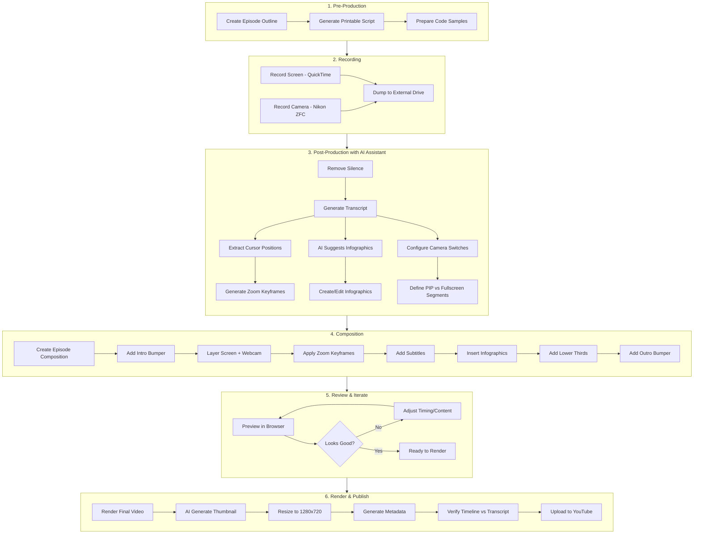

# Production Workflow

Complete step-by-step guide for producing Programming Fundamentals episodes.

## Workflow Overview



## AI-Assisted Workflow Summary

| Step | What You Do | What AI Does |
|------|-------------|--------------|
| Outline | Provide topic & key points | Generate structured outline with timestamps |
| Recording | Record camera + screen | - |
| Silence Removal | Run script | Detect & remove silent sections |
| Transcription | Run Whisper | Generate timestamped transcript |
| Zoom/Pan | Run cursor extraction | Auto-generate zoom keyframes from cursor movement |
| B-Roll Assets | Review & approve | Create infographics, animations, diagrams |
| Camera Switching | Define preferences | Generate switch points based on content type |
| Subtitles | Review output | Generate from transcript |
| Render | Run command | - |
| Thumbnail | Provide prompt | Generate image, resize to 1280x720 |
| Timeline verification | Review corrections | Cross-reference transcript timestamps with composition offsets |
| Upload | Provide credentials | Generate title, description, tags from outline |

---

## Step 1: Storage Setup (One-time)

Keep project on laptop, store large video files on external drive:

```bash
# Create folders on external drive
mkdir -p "/path/to/external/drive/seri-programming-fundamental/rendered"

# Create symlinks in footage/ folder (for transcript processing scripts)
mkdir -p footage/programming-fundamentals
ln -s "/path/to/external/drive/seri-programming-fundamental/ep-01/camera/DSC_8013.MOV" \
  footage/programming-fundamentals/pf-01-camera.mov
```

**Video file access for Remotion:**

The project uses `Config.setPublicDir()` in `remotion.config.ts` to point directly to the external drive:

```ts
// remotion.config.ts
Config.setPublicDir("/path/to/external/drive/seri-programming-fundamental");
```

This allows compositions to use `staticFile()` with relative paths:

```tsx
// src/tutorials/programming-fundamentals/video-paths.ts
import { staticFile } from "remotion";

export const VIDEO_PATHS = {
  "pf-01-camera": staticFile("ep-01/camera/DSC_8013.MOV"),
  "pf-02-camera-1": staticFile("ep-02/camera/DSC_8014.MOV"),
  // ...
} as const;
```

**Note:** Ensure the external drive is mounted before starting Remotion Studio or rendering.

---

## Step 2: Pre-Production

Refer to `src/tutorials/programming-fundamentals/SERIES_PLAN.md` for the full curriculum.
Prepare code samples and talking points for the episode topic.

---

## Step 3: Recording

**Equipment:**
- **Camera**: Nikon ZFC → records to SD card as `.MOV`
- **Screen**: QuickTime Player → Screen Recording → saves as `.mov`

**Raw footage organization:**

After recording, dump files to a staging folder named by topic:
```
seri-programming-fundamental/raw-footage/<topic-name>/
├── camera/
│   └── DSC_XXXX.MOV
└── screencasts/
    └── Screen Recording YYYY-MM-DD at HH.MM.SS.mov
```

**Move to episode folder:**

```bash
# Create episode folder structure
mkdir -p public/footage/ep-04/camera public/footage/ep-04/screen

# Move footage from staging
mv ../seri-programming-fundamental/raw-footage/hello-world/camera/*.MOV \
   public/footage/ep-04/camera/
mv ../seri-programming-fundamental/raw-footage/hello-world/screencasts/*.mov \
   public/footage/ep-04/screen/
```

**Create symlinks for transcript processing:**

```bash
cd footage/programming-fundamentals

# Camera footage
ln -s "/Volumes/ENDY1TB/Video Production/remotion-projects/public/footage/ep-04/camera/DSC_8017.MOV" \
   pf-04-camera.mov

# Screen recording
ln -s "/Volumes/ENDY1TB/Video Production/remotion-projects/public/footage/ep-04/screen/Screen Recording 2026-02-04 at 08.52.25.mov" \
   pf-04-screen.mov
```

**Naming conventions:**

Symlinks in `footage/programming-fundamentals/`:
- `{series}-{episode}-{type}[-{number}].{ext}`
- series: `pf` for Programming Fundamentals
- episode: `01`, `02`, etc.
- type: `camera` or `screen`
- number: optional, for multiple recordings of same type

Examples:
- `pf-01-camera.mov` (single camera take)
- `pf-02-camera-1.mov`, `pf-02-camera-2.mov` (multiple camera takes)
- `pf-02-screen-1.mov`, `pf-02-screen-2.mov` (multiple screen sessions)

---

## Step 4: Post-Production with AI Assistant

Start a session with Claude:

```
"I have recorded footage for Programming Fundamentals Episode 5.
Camera footage is on the SD card, screen recording in ~/tmp/screencast.
Let's process and create the video."
```

### 4.0 Inventory All Footage

**IMPORTANT**: Before processing, list ALL files to ensure nothing is missed.

```bash
ls -la /path/to/external/drive/seri-programming-fundamental/ep-XX/camera/
ls -la /path/to/external/drive/seri-programming-fundamental/ep-XX/screen/
```

**Why multiple files?**
- Camera has FAT filesystem limit: 4GB or 30 minutes max per file
- Camera auto-stops and restarts, creating new files
- Screen recording may restart if software crashes

**Checklist for each episode:**
- [ ] List ALL camera files
- [ ] List ALL screen recordings
- [ ] Create symlinks for EACH file
- [ ] Transcribe EACH file
- [ ] Sync screen recordings to camera timeline

### 4.1 Remove Silence

```bash
# Quick: remove silence and output new file
./scripts/remove-silence.sh footage/programming-fundamentals/pf-01-screen.mp4

# Or for more control: detect first, review, then apply
./scripts/detect-silence.sh footage/programming-fundamentals/pf-01-screen.mp4
node scripts/detect-silence.mjs footage/programming-fundamentals/pf-01-screen-silence.txt \
  --output src/tutorials/programming-fundamentals/pf-01-edl.ts
```

### 4.2 Generate Transcript

**Apple Silicon (M1/M2/M3) - Recommended:**

```bash
source .venv/bin/activate

# Transcribe with mlx-whisper (Indonesian)
mlx_whisper footage/programming-fundamentals/pf-01-camera.mov \
  --output-dir footage/programming-fundamentals \
  --output-format json \
  --word-timestamps True \
  --model mlx-community/whisper-medium \
  --language id

# Convert to Remotion format
node scripts/process-transcript.mjs \
  footage/programming-fundamentals/pf-01-camera.json \
  src/tutorials/programming-fundamentals/pf-01-transcript.ts
```

**Available mlx-whisper models:**
- `mlx-community/whisper-tiny` - Fastest, lower accuracy
- `mlx-community/whisper-base` - Fast, decent accuracy
- `mlx-community/whisper-small` - Balanced
- `mlx-community/whisper-medium` - Recommended for Indonesian
- `mlx-community/whisper-large-v3` - Best accuracy, slower

### 4.3 Sync Camera and Screen Recordings

```bash
# Sync by matching spoken phrases between recordings
node scripts/sync-transcripts.mjs \
  footage/programming-fundamentals/pf-02-camera-1.json \
  footage/programming-fundamentals/pf-02-screen-1.json \
  src/tutorials/programming-fundamentals/pf-02-sync-screen1.ts
```

The sync script outputs:
- **offset**: Time difference in seconds
- **confidence**: Match quality (0-1)

### 4.4 Auto-Generate Zoom Keyframes

Two approaches available, **recommend hybrid**:

**Option A: Cursor Detection (automated, ~1.4x realtime)**
```bash
source .venv/bin/activate

# Extract cursor positions (~37 min for 26-min video)
python scripts/extract-cursor.py footage/programming-fundamentals/pf-05-screen.mov

# Generate zoom keyframes
node scripts/generate-zoom-keyframes.mjs \
  footage/programming-fundamentals/pf-05-screen.cursor.json \
  --output src/tutorials/programming-fundamentals/pf-05-zoom.ts
```

**Option B: Transcript Hints (manual, ~5 min)**

Search transcript for keywords indicating zoom-worthy moments:
- Terminal commands: "jalankan", "run", "java", "node", "python"
- Editor actions: "ketik", "tulis", "hapus", "kasih"

**Comparison (from ep05 analysis):**

| Aspect | Cursor Detection | Transcript Hints |
|--------|------------------|------------------|
| Time | 37 min (automated) | ~5 min (manual) |
| Output | 67 keyframes (many) | 6-10 keyframes (focused) |
| Catches | Editor pauses, menu clicks | Verbal teaching cues |
| Misses | Fast typing, cursor moving | Requires manual review |

**Recommendation: Hybrid Approach**
1. Run cursor detection as base (catches editor work)
2. Review transcript for terminal commands (often missed by cursor detection)
3. Merge both into final zoom keyframes

Example findings from ep05:
- Cursor detection caught editor edits at 3:08-3:46
- Cursor detection missed first `java hello.java` command at 2:35
- Terminal commands need transcript-based identification

### 4.5 Generate Infographics (AI-Assisted)

Ask the AI assistant:
```
"Based on the transcript, suggest infographics (slides, bullet points, callouts)
that would enhance the video. Focus on key concepts and important tips."
```

### 4.6 Configure Camera Switching (AI-Assisted)

Ask the AI assistant:
```
"Based on the transcript and outline, determine when to show:
- Webcam fullscreen (introductions, explanations, conclusions)
- Screen with webcam PIP (coding, demos)
- Screen only (complex code, diagrams)"
```

### 4.7 Create B-Roll / Visual Enhancements

For talking-head episodes, add visual variety:

**B-Roll component workflow:**
1. AI analyzes transcript to identify visual opportunities
2. Create components in `src/tutorials/programming-fundamentals/components/`
3. Export from `components/index.ts`
4. Add to composition with appropriate timing

**B-Roll timing guidelines:**
- Match b-roll start time to when topic is mentioned in transcript
- Duration: 30-60 seconds per visual
- Cover 50-70% of talking-head content with b-roll for engagement

---

### 4.8 Re-encode Source Footage

**MANDATORY before rendering.** Nikon ZFC `.MOV` and QuickTime `.mov` files use codecs that cause Remotion/Chrome decoding errors (`Page crashed!`, `EncodingError`). Always re-encode to H.264 before rendering.

```bash
# Re-encode all footage with hardware acceleration (VideoToolbox)
# Use 12Mbps for source-quality preservation
cd public/footage/ep-XX

# Camera files
ffmpeg -i camera/DSC_XXXX.MOV -c:v h264_videotoolbox -b:v 12M -c:a aac -b:a 192k camera/camera-1-fixed.mp4

# Screen recordings
ffmpeg -i "screen/Screen Recording YYYY-MM-DD at HH.MM.SS.mov" -c:v h264_videotoolbox -b:v 12M -c:a aac -b:a 192k screen/screen-1-fixed.mp4
```

Then update `video-paths.ts` to point to the `-fixed.mp4` files.

**Bitrate guidelines:**
- 12M: Source quality (camera/screen footage for editing)
- 8-10M: Final output (YouTube upload)

**Time estimates (Apple Silicon M1, VideoToolbox):**

| File | Size | Duration | Re-encode Time |
|------|------|----------|----------------|
| Camera short clip (26s) | 81MB | 0:26 | ~5 seconds |
| Camera segment (5 min) | 973MB | 5:00 | ~30 seconds |
| Screen recording (10 min) | 1.3GB | 10:00 | ~1 minute |
| Camera full (20 min) | 3.6GB | 20:00 | ~2 minutes |
| Screen full (20 min) | 2.3GB | 20:00 | ~1.5 minutes |

All files for a 25-min episode (~5 files): **~5 minutes total** (can run in parallel)

---

## Step 5: Create Composition

Compositions are organized in `src/tutorials/programming-fundamentals/compositions/`.

**Every episode should include:**
- `PFIntro` - Series intro bumper (5 seconds)
- Main content with subtitles
- B-roll/visual enhancements where appropriate
- `PFOutro` - Thank you + next episode preview (6 seconds)

See [COMPONENTS.md](./COMPONENTS.md) for component usage.

---

## Step 6: Preview & Iterate

```bash
npm start
# Open browser, select composition, review
```

Work with AI to adjust:
- Timing of infographics
- Zoom keyframe positions
- Camera switch points
- Subtitle styling

---

## Step 7: Render

**Segmented Remotion Render (for long videos):**

```bash
# Render in 5000-frame segments (~2.7 min each), then concatenate
./scripts/render-segments.sh PF06-Full rendered/pf-ep06-variables.mp4 5000
```

**How it works:**
1. Starts HTTP server serving `public/footage/` on port 3333
2. Creates empty public folder for bundling (avoids copying large files)
3. Renders each segment with `--concurrency=1` to limit memory
4. Concatenates segments with FFmpeg

**Working render configuration:**

| Parameter | Value | Notes |
|-----------|-------|-------|
| Segment size | 5000 frames (~2.7 min) | Prevents Chrome memory crashes |
| Concurrency | 1 | Single renderer, avoids memory exhaustion |
| Video cache | 4GB (`4294967296` bytes) | `--offthread-video-cache-size-in-bytes` |
| Footage server port | 3333 | HTTP server for video files |
| Bundling public dir | Empty `/tmp` dir | Prevents copying large footage into bundle |

**Prerequisites before render:**
- Re-encoded footage (Step 4.8) — raw MOV files crash Chrome
- Known frame count in `render-segments.sh` case statement (skips bundling for duration)
- External drive mounted with footage accessible

**Adding frame counts** (for faster startup, avoids bundling to get duration):
```bash
# In scripts/render-segments.sh, add to the case statement:
case "$COMPOSITION_ID" in
    "PF06-Full") TOTAL_FRAMES=45737 ;;
    ...
esac
```

**Render time estimates (Apple Silicon M1, 16GB RAM):**

| Episode Length | Frames | Segments | Bundling | Per Segment | Total |
|----------------|--------|----------|----------|-------------|-------|
| ~20 min | ~34k | 7 | ~8 min | ~15-20 min | ~2-2.5 hours |
| ~25 min | ~45k | 10 | ~8 min | ~15-20 min | ~3-3.5 hours |
| ~26 min | ~47k | 10 | ~8 min | ~15-20 min | ~3-3.5 hours |

**Resume interrupted render:**
```bash
RESUME_DIR=rendered/segments-XXXXX ./scripts/render-segments.sh PF06-Full rendered/ep06.mp4 5000
```
Existing segment files are automatically skipped.

**Troubleshooting:**
- `Page crashed!` → Source footage not re-encoded. Run Step 4.8 first.
- Render hangs after "Rendering segment X" → Bundling in progress (~8 min first time). Check with `ps aux | grep remotion`.
- Out of memory → Reduce segment size (try 3000) or ensure `--concurrency=1`.

---

## Step 8: Upload to YouTube

**One-time setup:**

1. Create Google Cloud project at https://console.cloud.google.com/
2. Enable YouTube Data API v3
3. Create OAuth 2.0 credentials (Desktop app type)
4. Download JSON and save as `client_secret.json` in project root
5. Add yourself as test user in OAuth consent screen
6. Authenticate: `node scripts/youtube-auth.mjs`

**Generate metadata:**

```bash
# Generate with scheduling
node scripts/generate-youtube-metadata.mjs all --start-date 2026-02-01 --interval 2

# Single episode
node scripts/generate-youtube-metadata.mjs ep01
```

**Verify timeline markers against transcript (MANDATORY):**

The metadata generator produces placeholder timestamps from pre-production outlines.
These are almost always wrong — they don't account for actual recording flow, topic order
changes, tangents, or the intro/outro bumper offsets in the final video.

After rendering, verify every `⏱️ Timeline:` entry in the metadata JSON against the actual
transcript. Ask Claude:

```
"Verify the timeline markers in scripts/youtube-metadata/epXX.json against the
transcript. Read the transcript files and the composition to map camera timestamps
to final video timestamps. Report mismatches and suggest corrections."
```

**How final video time maps to camera time:**

The rendered video has sections that shift the timeline relative to raw camera timestamps:

```
Final video time 0s          → Welcome (camera-1 start)
  + WELCOME_DURATION         → PFIntro bumper (no camera, ~5s)
  + INTRO_DURATION           → Camera-only section
  + CAMERA_ONLY_DURATION     → Main content (screen+PIP)
  - transition overlaps      → Transitions eat ~0.67s each
```

General formula for a timestamp in the main content:

```
videoTime = WELCOME_DURATION + INTRO_DURATION + CAMERA_ONLY_DURATION
          + (cameraTime - MAIN_CONTENT_START_CAMERA_TIME)
          - accumulated_transition_overlaps
```

These values differ per episode — always read the composition file (`PFxxComposition.tsx`)
for the exact constants.

**Common mistakes in timeline markers:**
- Round-number timestamps (02:00, 05:00, 10:00) — sign of placeholders, never real
- Wrong topic order (outline may say Python→JS→Java, actual recording may be Java→JS→Python)
- Missing bumper offset (forgetting the ~5s PFIntro bumper shifts everything)
- Multi-file boundary errors (camera FAT32 splits cause time resets; camera-3 time 0s ≠ continuation of camera-2)
- Topics interleaved in recording but listed as separate blocks in outline

**Generate thumbnails:**

```bash
# Resize AI-generated image to YouTube format
ffmpeg -i ~/Downloads/ep01-thumbnail.png \
  -vf "scale=720:720,pad=1280:720:(ow-iw)/2:0:color=#0d1117" \
  thumbnails/ep01.png
```

**Upload videos:**

```bash
# Single episode
node scripts/youtube-upload.mjs scripts/youtube-metadata/ep01.json path/to/rendered/pf-ep01.mp4

# Batch upload
node scripts/youtube-batch-upload.mjs ep01 ep03
```

---

## Processing Time Reference (EP06, 25-min video, Apple Silicon M1)

| Step | Time | Notes |
|------|------|-------|
| Copy files from SD card | ~2 min | ~5GB total |
| Re-encode footage (VideoToolbox) | ~5 min | 5 files in parallel, h264_videotoolbox 12Mbps |
| Transcription (mlx-whisper) | ~20 min | 3 camera files, turbo-v3 model |
| Sync transcripts | <1 sec | Automated timestamp matching |
| Create composition | ~30 min | Manual with AI assistance |
| Preview & iterate | ~15 min | Remotion Studio |
| Render (segmented, 10 segments) | ~3.5 hours | ~8 min bundling + ~15 min/segment, concurrency=1 |
| Verify timeline markers | ~10 min | AI cross-references transcript vs composition offsets |
| **Total** | **~4.5 hours** |
